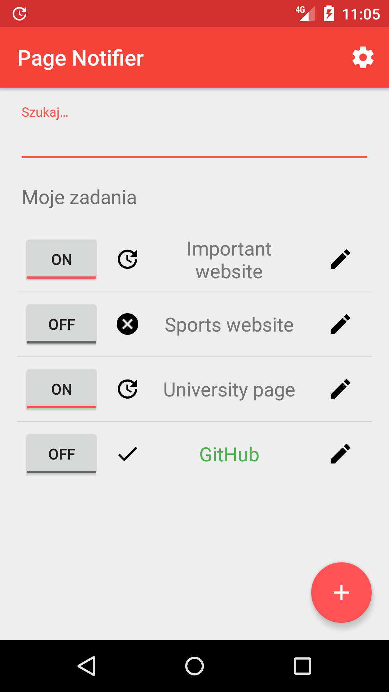
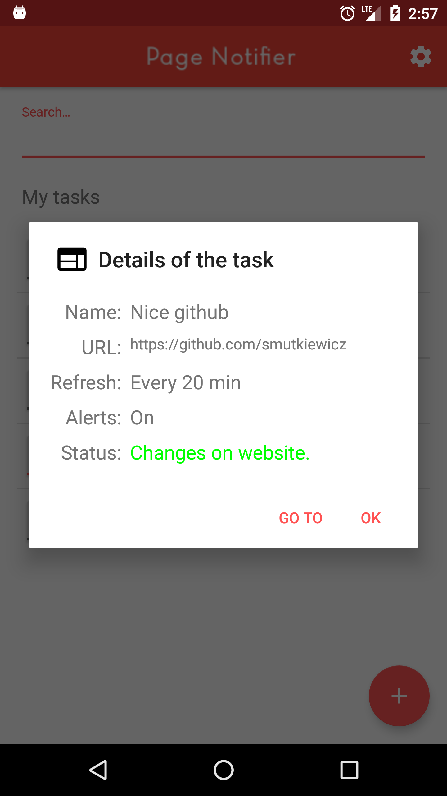
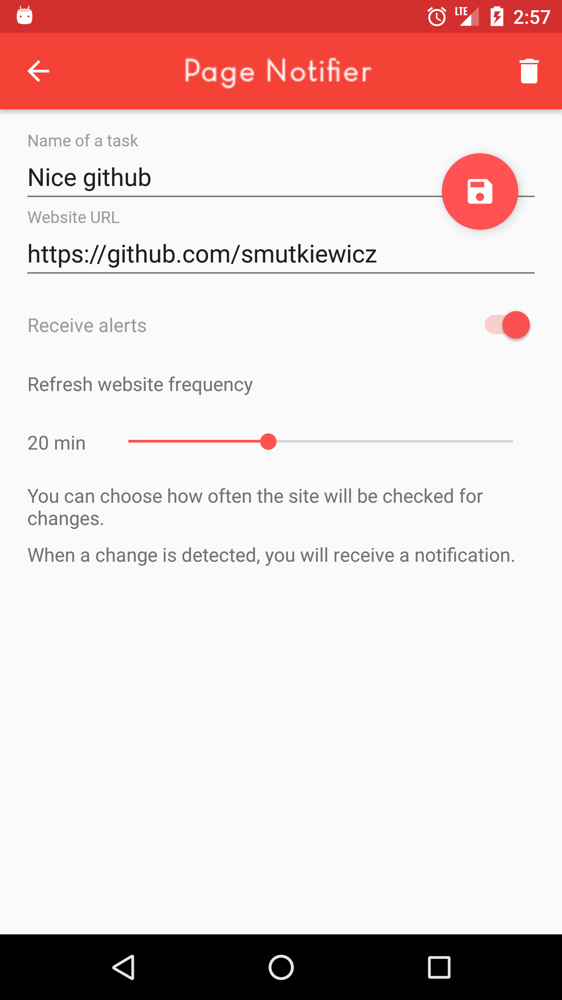
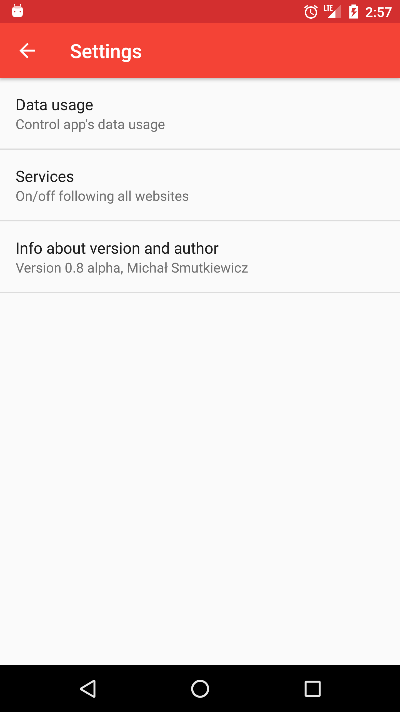

 # Page Notifier
 Czêsto czekaj¹c na konkretn¹ informacjê (w moim przypadku by³y to wyniki kolokwium, czy egzaminu) na konkretnej stronie, sprawdza³em j¹ ca³kiem sporo razy na dzieñ. Proces - odpalanie przegl¹darki i szukanie na stronie informacji wyda³ mi siê mêcz¹cy (gdy robi siê to œrednio co 10 minut). Zainstalowa³em wiêc wtyczkê do Firefoxa informuj¹c¹ o zmianach na stronie. Dzia³a³a ona jednak tylko, gdy w³¹czony by³ Firefox. Potrzebujê wiêc wygodniejszego sposobu na elastyczne, szybkie i wygodne powiadamianie.
 
 # aplikacja
 Implementacja "sprawdzacza" w systemie Android. Aplikacja, która po wprowadzeniu szczegó³ów, bêdzie na bie¿¹co, w tle, sprawdzaæ konkretn¹ stronê w poszukiwaniu zmian od chwili wydania polecenia obserwacji.

 # screenshoty (wersja beta 0.8)
 

   
	
   
	
   
	
  
	

 # czego siê nauczy³em:
* Systematycznego, etapowego i rozmyœlnego podejœcia do projektu - najpierw layout, potem kod UI (szkielet dzia³ania), a na koniec implementacja
* Korzystania z ContentProviders (wygodny dostêp do bazy danych z ka¿dego miejsca w projekcie
* Korzystania z serwisów i zasad ich dzia³ania (najpierw próbowa³em IntentService, potem okaza³o siê, ¿e JobScheduler pasuje lepiej do mojego typu zadania)
* Improvement w projektowaniu architektury - starania w celu trzymania siê zasad rozdzielenia abstrakcji (jest sporo do poprawy, ale jest ju¿ zdecydowanie lepiej ni¿ kiedyœ)
* Pisania lepszego kodu (zasada pojedynczej odpowiedzialnoœci, opisowe nazwy zmiennych i funkcji, usystematyzowanie !jednolitego! stylu !W KOÑCU!)

 # czego muszê siê jeszcze nauczyæ:
* Testy - mockowanie, Espresso, JUnit, bo wci¹¿ nie ma u mnie kultury testera: "najpierw testy - potem implementacja"
* Wielow¹tkowoœæ - uda³o siê j¹ osi¹gn¹æ, ale to by³ ten pierwszy raz i nastêpny musi byæ lepszy!

 # TODO
 * ~~Zacz¹æ~~ (Done!)
 * ~~Layout aplikacji~~ (Done!)
 * ~~Implementacja logiki UI reaguj¹cej na serwis~~ (Done!)
 * ~~Opcja dodawania itemów z adresami stron do bazy i przegl¹dania ich z mo¿liwoœci¹ edycji i usuwania~~ (Done!)
 * ~~Opcja uruchomienia us³ugi porównuj¹cej stronê z dan¹ przez u¿ytkownika czêstotliwoœci¹ (dzia³aj¹cej w tle niezale¿nie od aktywnoœci g³ównej~~ (Done!)
 * ~~Opcja wys³ania powiadomienia przez us³ugê dzia³aj¹c¹ w tle~~ (Done!)
 * ~~Refactor metod do uruchamiania serwisu w MainActivity (mo¿e oddzielna klasa?)~~ (Done!)
 * ~~Logo aplikacji i t³umaczenie stringów na jêzyk angielski~~ (Done!)
 * Œledzenie pobranej iloœci danych
 * Uruchamianie zadania w zale¿noœci od dostêpnoœci WiFi lub sieci
 * Porz¹dne czyszczenie kodu - usuniêcie logów do debuggowania
 * Testy testy testy i jeszcze raz testy!

